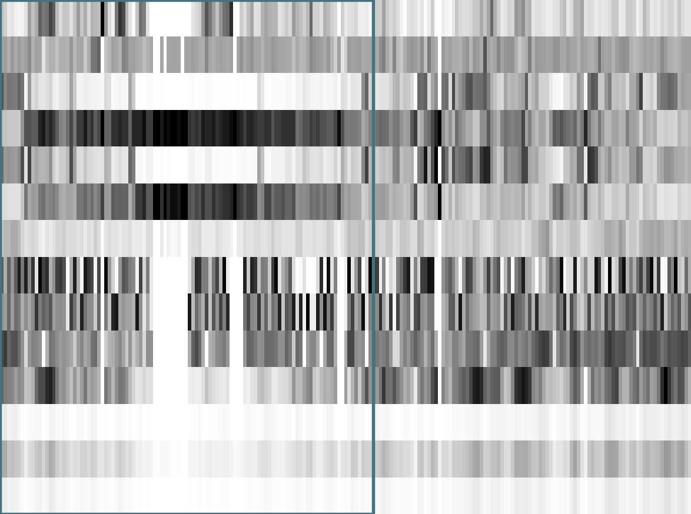
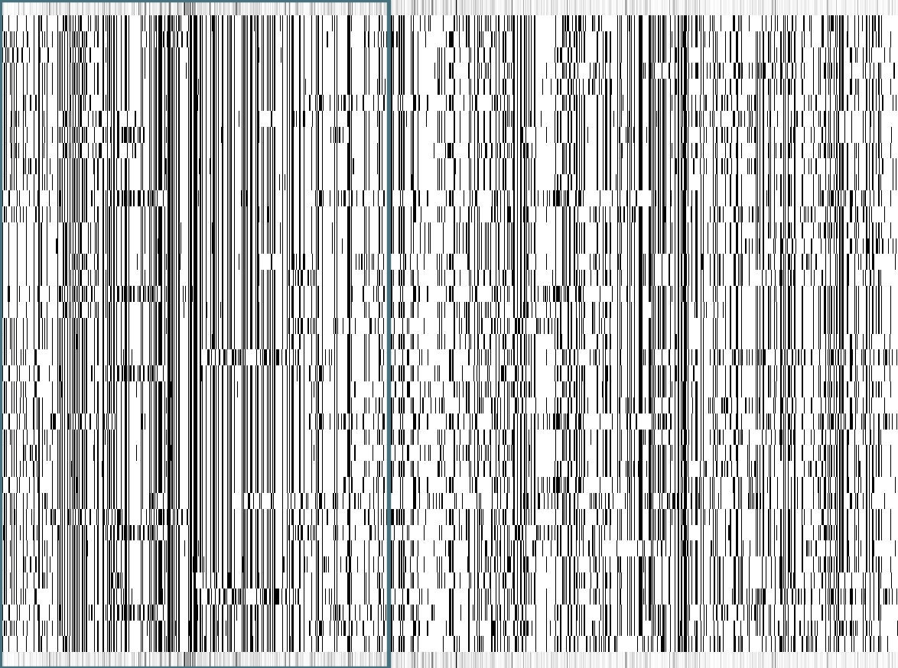

- [deepDILS](#deepdils)
  * [simplest illustrative example](#simplest-illustrative-example)
  * [in practice](#in-practice)
    + [calculating statistics in sliding windows](#calculating-statistics-in-sliding-windows)
    + [producing jpg for learning](#producing-jpg-for-learning)
    + [main outputs](#main-outputs)
      - [globalPic](#globalpic)
      - [rawData](#rawdata)

# deepDILS
## simplest illustrative example
```
nIndividuals=40
nReplicates=100
nSNPs=2000
rho=300
length=100000

window_width=0.01
window_step=0.005

# simulated 100 replicates of a sweep
msms $nIndividuals $nReplicates -s $nSNPs -r $rho $length -SAA 200 -SaA 100 -SF 1e-2 -N 100000 -Sp 0.5 >output.ms

# calculated statistics along chromosomes
python3 ../scripts/msmscalc_onePop.py infile=output.ms nIndiv=$nIndividuals nCombParam=1 regionSize=$length width=$window_width step=$window_step nRep=$nReplicates root=outputStats
```
Here, a sweep was simulated 100 times in the middle of a chromosome of 100-kb, sequenced in 40 sampled gametes.  

  
## in practice  
With two simulated datasets using the Guillaume Lan-Fong's SLiM pipeline producing the following files:
- 101_neutral_positions.txt  
- 101_neutral_sumStats.txt  
- 100_neutral_positions.txt  
- 100_neutral_sumStats.txt  
- 101_neutral.ms  
- 101_neutral_recap_mut.trees  
- 101_neutral_recap.trees  
- 100_neutral.ms  
- 100_neutral_recap_mut.trees  
- 100_neutral_recap.trees  
- 101_neutral_parameters.txt  
- 101_neutral.trees  
- 100_neutral_parameters.txt  
- 100_neutral.trees  
- 101_sweep_positions.txt  
- 101_sweep_sumStats.txt  
- 100_sweep_positions.txt  
- 100_sweep_sumStats.txt  
- 101_sweep.ms  
- 101_sweep_recap_mut.trees  
- 101_sweep_recap.trees  
- 100_sweep.ms  
- 100_sweep_recap_mut.trees  
- 100_sweep_recap.trees  
- 100_sweep_parameters.txt  
- 100_sweep.trees  
- 101_sweep_parameters.txt  
- 101_sweep.trees  

### calculating statistics in sliding windows  
In the _example_ subdirectory:  
```
cd example
for iteration in 100 101; do
	for model in neutral sweep; do
		echo ${iteration}_${model}
		python3 ../scripts/msmscalc_onePop.py infile=${iteration}_${model}.ms nIndiv=40 nCombParam=1 regionSize=100000 width=0.01 step=0.005 nRep=1 root=${iteration}_${model}
	done
done
```
**nIndiv**: number of sampled gametes within the simulated population.  
**nCombParam**: number of different combination of parameters with a single **ms** output file.  
**nRep**: number of replicates for each of the different combination of parameters found within a single **ms** output file.    
**regionSize**: size in bp of the simulated chromosome.  
**width**: size of the sliding window in bp divided by **regionSize**. i.e, if *width=0.01* for *regionSize=100000*, then the actual window's width is 1kb.  
**step**: step of the sliding window. Same unit as for **width**. i.e, if *step=0.005*, then the window slides with a step of 500bp.  
**root**: root name used to write the different output files.  
  
### producing jpg for learning  
In the _example_ subdirectory:  
```
# go through all simulated datasets a first time, in order to get the range of variation for each stat : getAllData=1  
python3 ../scripts/sim2box_single_YOLOv5.py dpi=300 datapath=$PWD simulation=100 object=posSelection theta=0 phasing=1 plotStats=0 getAllData=1 modelSim=both &

# can then be run independently for all simulated datasets: getAllData=0  
for iteration in $(ls *.ms | cut -d "." -f1 | sed "s/_neutral//g" | sed "s/_sweep//g" | sort | uniq); do
	python3 ../scripts/sim2box_single_YOLOv5.py dpi=300 datapath=$PWD simulation=${iteration} object=posSelection theta=0 phasing=1 plotStats=0 getAllData=0 modelSim=both &
done
```
**phasing**: to specify whether the data where phased or not. For phased data (*phasing=1*): statistics relative to LD are computed (*nHaplotypes, H1, H2, H12, H2 over H1, D, r2*).   
**plotStats**: for only plotting jpg files used for machine learning (and not one additional plot per individual statistics) set *plotStats* to 0. If you want multiple jpg files: plotStats=1.  
**datapath**: datapath of a directory with all *neutral* and *sweep* pairs of simulations.  
**dpi**: resolution of the jpg files.  
**theta**: specify the way we define the bounding box. If *theta=1*, then the bounding box is delimited by 4.N.mu. If *theta=0*, then the bounding box is delimited by the average pi calculated from the **neutral** simulation.  
**modelSim**: specify whether the simulated models are **sweep** (only simulations with selective sweep), **neutral** (only simulations without sweeps) or **both** (with both **sweep.ms** and **neutral.ms** files in the directory)
    
### main outputs  
- 100_neutral_rawData.txt
- 100_neutral_rawData.jpg
- 100_sweep_rawData.txt
- 100_sweep_rawData.jpg
- 101_neutral_rawData.txt
- 101_neutral_rawData.jpg
- 101_sweep_rawData.txt
- 101_sweep_rawData.jpg
- 100_neutral_globalPic.txt
- 100_neutral_globalPic.jpg
- 100_sweep_globalPic.txt
- 100_sweep_globalPic.jpg
- 101_neutral_globalPic.txt
- 101_neutral_globalPic.jpg
- 101_sweep_globalPic.txt
- 101_sweep_globalPic.jpg
  
**jpg** files correspond to simulated genomes.  
**txt** files are associated to jpg files and correspond to coordinates of the box for YOLOv5 : object x_center y_center width height.  
  
#### globalPic  
summary statistics along windows.  

Eeach column is a window, and each row is a statistics with, from the bottom to the top:  
- **pi (avg)**  
- **pi (std)**  
- **theta (avg)**  
- **Tajima's D**
- **Achaz's Y**  
- **Pearson's r for pi**  
- **Pearson's r pval for pi**   
- **Number of haplotypes**
- **Haplotype's homozygosity (H1)**  
- **Haplotype's homozygosity without the most common haplotype (H2)**  
- **Haplotype's homozygosity considering the two most common haplotype as the same one (H12)**  
- **H2 over H1**  
- **Linkage disequilibrium measured by D**  
- **LD measured by r2**  
  
#### rawData  
simulated haplotypes.  


